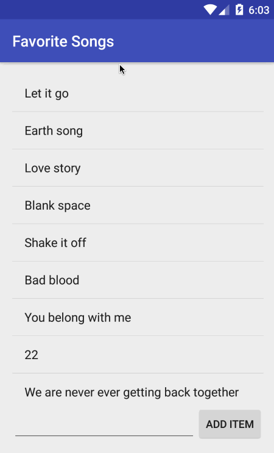

# Pre-work - *Favorite Songs*

**Favorite Songs** is an android app that allows building a favorite song list and basic songs management functionality including adding new songs, editing and deleting an existing song.

Submitted by: **Qianqian Zhong**

Time spent: **4** hours spent in total

## User Stories

The following **required** functionality is completed:

* [x] User can **successfully add and remove items** from the song list
* [x] User can **tap a song item in the list and bring up an edit screen for the song item** and then have any changes to the text reflected in the song list.
* [x] User can **persist song items** and retrieve them properly on app restart

## Video Walkthrough 

Here's a walkthrough of implemented user stories:

GIF created with [LiceCap](http://www.cockos.com/licecap/).
